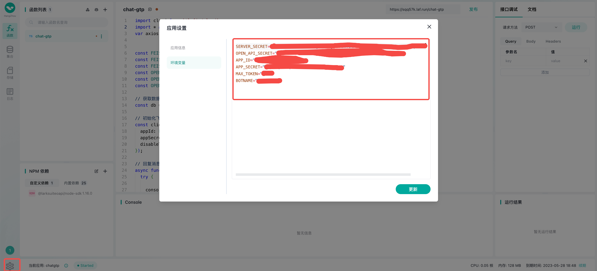

# laf-chatgtp-feishu
使用飞书机器人和chatgtp打通对话

本文帮助你快速实现一个飞书对话机器人，并在其中接入 ChatGPT 的能力，可以直接问它问题，也可以在群聊天中 at 它，返回 ChatGPT 的回答

# 通过本文你将学会
1. 创建飞书机器人，并配置事件和权限
2. 使用 laf 的「一键 Copy 代码」功能，实现机器人的聊天能力
3. 将机器人接入 ChatGPT 能力

# 第一步：创建飞书机器人
1. 在飞书开发者后台中创建一个应用，并且添加机器人能力。


2. 创建好的机器人就有 App ID 和 App Secret，可以复制备用。


第二步：创建 laf 应用
通过 `https://laf.run/` 创建一个新的应用, 点击开发进入下个页面


开发界面


导入飞书的node sdk包


设置环境变量

```txt
变量内容如下,替换成自己的就OK
SERVER_SECRET="xxx"
OPEN_API_SECRET="xxx"
APP_ID="xxx"
APP_SECRET="xxx"
MAX_TOKEN="1024"
BOTNAME="chat-gtp"
```

第三步：配置机器人的事件和权限

1. 应用部署成功后，代码copy到应用中发布后，你就能看到当前服务的调用 URL，将它复制，填到[飞书开发者后台](https://open.feishu.cn/app)刚刚创建机器人的「事件订阅-请求地址」中, 点击保存时，如果失败，可以将 laf 应用再次部署。


2. 给机器人添加「接收消息」的事件


3. 对应事件需要开启相应权限
- 获取用户在群组中@机器人的消息 im:message.group_at_msg（注意不要开启「获取群组中所有消息」的权限）
- 获取用户发给机器人的单聊消息 im:message.p2p_msg
- 获取与发送单聊、群组消息 im:message
- 以应用的身份发消息 im:message:send as bot


4. 配置好了之后，需要发布机器人才能生效，并且能够搜索到。 注意如果想加到群中让更多人看到，在发布机器人时需要选择更大的「可见范围」。


## 发布版本，等待审核
上述这些都配置完成后，你的机器人就配置好了，接下来只需要在飞书开放平台后台找到应用发布，创建一个全新的版本并发布版本即可。


- 注意参数是
  ```json
  {
    "check": 1
  }
  ```
  的情况下,接口会检查环境变量的配置是否正确.

  ## 


